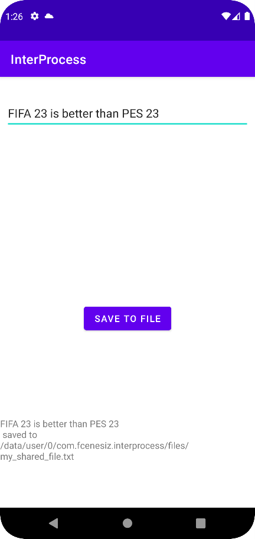
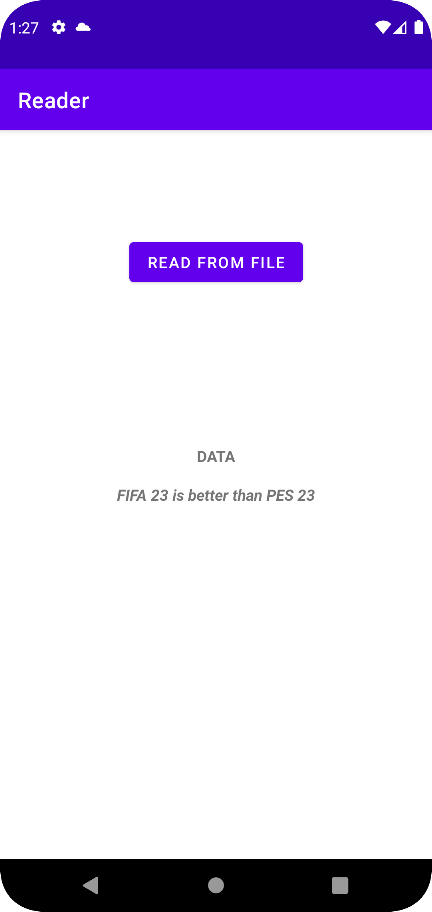

# InterProcess Data Sharing

- Shares data between apps which have same named userId
- need to add this
    ````xml 
    android:sharedUserId="my.custom.named.user.id"
    ````
  to ``AndroidManifest.xml`` file in ``<manifest>`` tag
  of both apps

 ``<->`` 